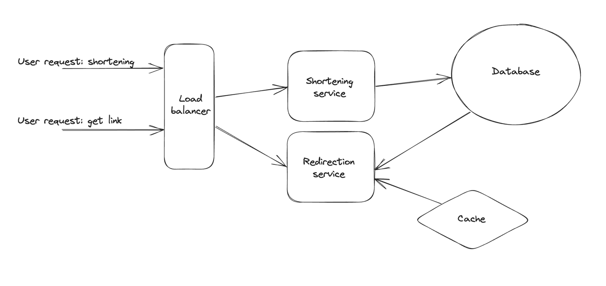

# sd-url-shortener
System Design: URL shortener approach

## Infrastructure
**capacity estimation**:
10k requests per day
ratio per service (redirect vs shortening) 100:1
replication: 3x
maximum database table capacity: 10kk
url size: 100-200 symbols

**storage estimation**:
10kk * 200 = 2 * 10^9 bytes

**cache**:
assume 15% hits
cache memory required: 2 * 10^9 * 15% = 300kk

## Architecture

## API design

_create url_
/api/v1/shorten (POST)
- url
- expiry_date
returns:
- http 201
- http 208 (already exists)
- 507 (unsifficient storage)

_redirect url_
/{url} (GET)
returns:
- http 308
- http 404

## Database
Assuming NoSQL:
+ fast
+ scalable
+ key-value storage

| shortens_table |
|----------------|
| original_url   |
| shortened_url  |
| url_hash       |
| expiry_date    |
| creation_date  |

| redirects_table |
|-----------------|
| url_hash        |
| click_count     |
| last_clicked    |

## Cache

ElasticCache?

## Shortening service

## Redirection service

